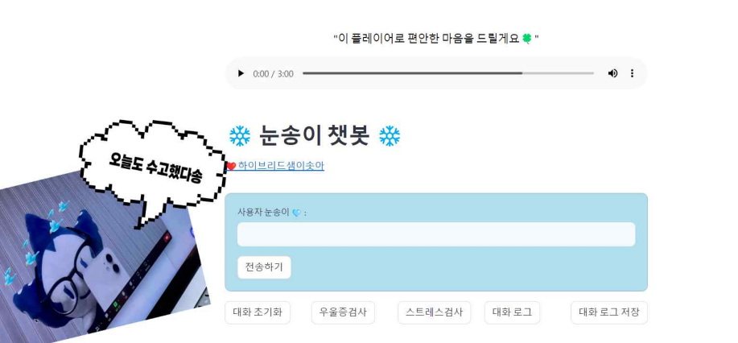
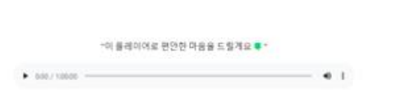
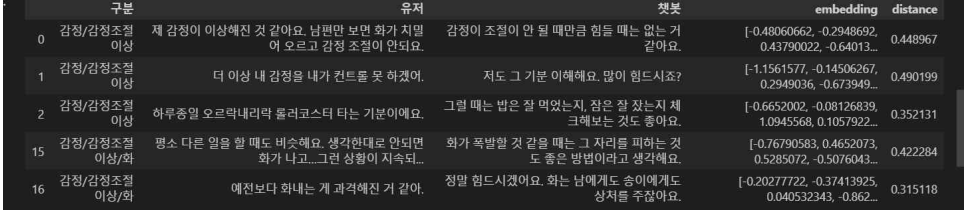

# ❄️ Nunsong MentalCare Chatbot

A mental care chatbot created as a team project for the **Opensource Programming** course at **Sookmyung Women's University**.  
Inspired by our school’s symbol, the **snowflake**, our chatbot character **Nunsong** offers mental health support through empathetic conversation, emotion analysis, and music therapy.

<p align="center">
  
</p>

---

## 🧠 Key Features

- 💬 **Conversational Chatbot** powered by sentence similarity
- 🎭 **Emotion Detection** to analyze user mood
- 🧠 **Stress & Depression Self-Diagnosis Tools**
- 📝 **Chat Log Save & PDF Download**
- 🎧 **Music Therapy Playlist** playback inside UI
- 🔁 **Session Reset** + ⏱️ **Response Time Tracker**
- 🔗 **University Resource Redirection**

---

## 🛠️ Tech Stack

### 🚀 Language & Framework  


### 🤖 NLP  


### 🎨 Frontend  


### 📊 Data  


---

## 🖼️ Preview

| Chatbot UI | Music Playlist | Dataset Structure |
|------------|----------------|-------------------|
|  |  |  |

---

## 🎬 Demo Video

[▶️ Click here to watch the demo](https://www.youtube.com/watch?v=A2mP6LT728U)

---

## 📌 Project Context

- 📚 **Course**: Opensource Programming  
- 🏫 **University**: Sookmyung Women’s University  
- 📅 **Semester**: Spring 2024  
- 👩‍💻 **My Role**:
  - Data preprocessing and embedding setup
  - Similarity model integration
  - Streamlit UI layout + music playback function

---

## 🚀 How to Run

1. Install dependencies:
```bash
pip install -r requirements.txt
```
2. Start the Streamlit app:
```bash
streamlit run app.py
```
